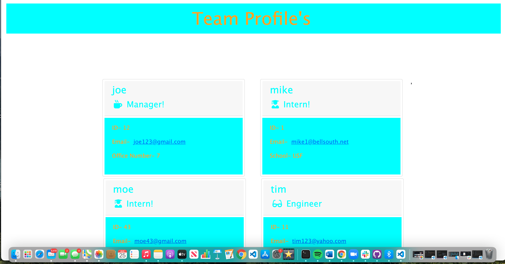

# READme Team-profile-generator!
   
  * [Information](#information)
  * [Installation](#installation)
  * [Usage](#usage)
  * [Contributing](#contributing)
  * [Test](#test)
  * [Questions](#questions)
  * [License](#license)
  
  # Information
  ~ there is Information, Installation, Usage, Contributing, Test, Questions and License
  
 ~ (https://drive.google.com/file/d/1ZkIltOvy7MyhO3SbGx1vF1i008Vli-vk/view)

  # Installation
  ~ It will be isntalled using node and updated based on quality of information aquired.
  # Usage
  ~ The project will be useful for generating a team working on a project.
  # Contributing
  ~ Node will be the main contributor and any information needed from the worked on project.
  # Test 
  ~ It will be tested through node and will be developed in the back end in order to design a page for HTML!
  # Questions
   This will be standard for setting up a design team online.
  * Feel free to reach out to my email: hello1234@gmail.com
  * To see more of my work check out my github! The username is: connerc11
  * Also click the link to have easy access to the Github! (https://github.com/connerc11)
  # License
   